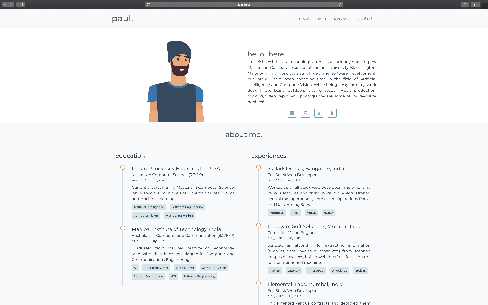
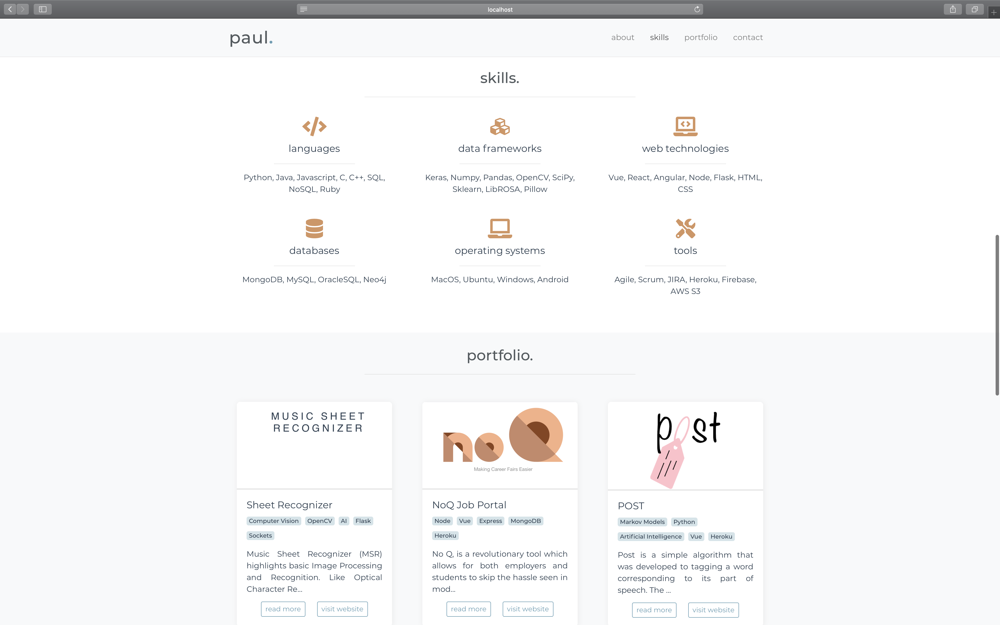
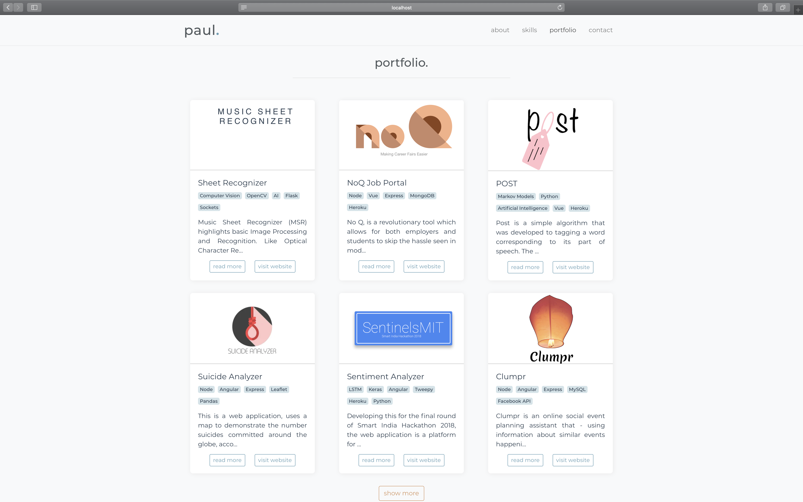
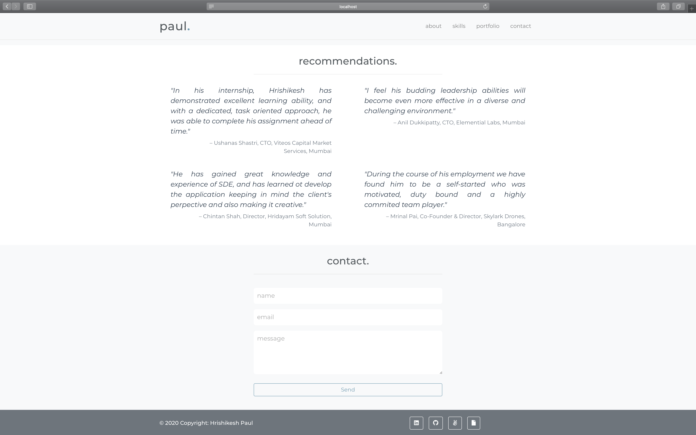

<!-- # Portfolio Template

This is a simple personal website template for people who want a simple personal website. This template is currently filled with my data, but one can replate it with theirs without much hastle. Furthermore, this is mobile compatible. Below I have mentioned the steps to get this on your system, and deploy it.







## Project Setup

This template is built using vuejs. Below are the steps to get the project up and running.

### Dependencies
1. npm
2. git

### Steps
```
git clone https://github.com/hrishikeshpaul/portfolio-template.git
```
```
cd portfolio-template
```
```
npm install
```

#### Compiles and hot-reloads for development
```
npm run serve
```

### Compiles and minifies for production
```
npm run build
```

## Editing Information

Edit the `info.js` file, and input your own data. All the images should go in the `src/assets` folder. 

> To change the title (the one that appears on the tabs), navigate to `public/index.html` and change the title there.

### Emailjs (Contact Form)

The **contact** section of the template makes use of this API called [emailjs](https://www.emailjs.com/). It is a good service that provides 200 email free every month. You will need to configure your own emailjs account for the service to work.

1. Head over to [emailjs](https://www.emailjs.com/) and create your account.
2. Once logged in, select a service. In my case I selected **gmail**.
3. Head over to **Email Templates** on the side and click on **Email Template Example**. Here, there are few changes to be made if you don't want to change the template's javascript code.
    - Change the subject attribute to: `New message from {{from_name}}!`
    - Change the body to, 
    ```js
    Hello {{to_name}},

    You got a new message from {{from_name}}:

    {{{message_html}}}

    My contact is: {{user_email}}.
    ```
    You can configure this however you want, but the attributes in the `{{ }}` need to be those.
4. Create a file called `config.js` in the root of the project. You'll notice that the `.gitignore` has the name of this file. This is where all the data that links your web app to emailjs will be stores.
5. Create a object that looks like this,
   ```js
   let config = {
        emailjs: {
            serviceID: '<serviceID>',
            templateID: '<templateID>',
            userID: '<userID>'
        }
    }

    export default config;
   ```
6. You need to get the above mentioned IDs from your emailjs account,
   - **serviceID**: From `Email Services`
   - **templateID**: From `Email Templates`
   - **userID**: From `Account` > `API Keys`

## Deployment

To get this deployed as a github page, follow the steps below,

1. Create a repository with this format: `<github_username>.github.io` (Ex: hrishikeshpaul.github.io). Doesn't matter if it's private or not.

2. Navigate to the folder on your computer and run the command `npm run build`. This will create a folder called `dist` (if you already have it, it will overwite it).

3. Take the contents of the `dist` folder and upload it onto the github repository you just created.

4. In your repository (<github_username>.github.io), go to the `Settings` Tab and scroll to **GitHub Pages**.

5. Click on the **source** dropdown, and select **master**.

6. Wait for a while, and then nagivate to `<github_username>.github.io` on your browser, and you should see your webisite up and running.

# Notes

Please feel free to post any issue if found, or mail me at hrpaul@iu.edu. -->


<!-- NEW STUFF HERE -->


# Portfolio Template

> This is a simple, minimal and responsive personal website template, built using vue-js, html and css.

[](https://hrishikeshpaul.github.io/)
[](https://github.com/npm/cli)
[](https://github.com/hrishikeshpaul/portfolio-template/blob/master/LICENSE) 
[](https://github.com/vuejs/vue)


<!-- 
 -->

Live [demo](https://hrishikeshpaul.github.io/).

---

## Table of Contents (Optional)

- [Installation](#installation)
- [Features](#features)
- [Contributing](#contributing)
- [Team](#team)
- [FAQ](#faq)
- [Support](#support)
- [License](#license)

---

## Installation

### Dependencies
These are the local dependencies that are needed for development,

- npm
- git

### Clone

Get this repo to your local machine using,
```shell
$ git clone https://github.com/hrishikeshpaul/portfolio-template.git
```

### Setup

> Navigate to the project folder

```shell
$ cd portfolio-template
```

> To install the node packages used in the project:

```shell
$ npm install
```

> Compiles and hot-reloads for development

```shell
$ npm run serve
```

> Compiles and minifies for production
```shell
$ npm run build
```

---

## Features
## Usage (Optional)
## Documentation (Optional)
## Tests (Optional)

- Going into more detail on code and technologies used
- I utilized this nifty <a href="https://github.com/adam-p/markdown-here/wiki/Markdown-Cheatsheet" target="_blank">Markdown Cheatsheet</a> for this sample `README`.

---

## Contributing

> To get started...

### Step 1

- **Option 1**
    - 🍴 Fork this repo!

- **Option 2**
    - 👯 Clone this repo to your local machine using `https://github.com/joanaz/HireDot2.git`

### Step 2

- **HACK AWAY!** 🔨🔨🔨

### Step 3

- 🔃 Create a new pull request using <a href="https://github.com/joanaz/HireDot2/compare/" target="_blank">`https://github.com/joanaz/HireDot2/compare/`</a>.

---

## Team

> Or Contributors/People

| <a href="http://fvcproductions.com" target="_blank">**FVCproductions**</a> | <a href="http://fvcproductions.com" target="_blank">**FVCproductions**</a> | <a href="http://fvcproductions.com" target="_blank">**FVCproductions**</a> |
| :---: |:---:| :---:|
| [](http://fvcproductions.com)    | [](http://fvcproductions.com) | [](http://fvcproductions.com)  |
| <a href="http://github.com/fvcproductions" target="_blank">`github.com/fvcproductions`</a> | <a href="http://github.com/fvcproductions" target="_blank">`github.com/fvcproductions`</a> | <a href="http://github.com/fvcproductions" target="_blank">`github.com/fvcproductions`</a> |

- You can just grab their GitHub profile image URL
- You should probably resize their picture using `?s=200` at the end of the image URL.

---

## FAQ

- **How do I do *specifically* so and so?**
    - No problem! Just do this.

---

## Support

Reach out to me at one of the following places!

- Website at <a href="http://fvcproductions.com" target="_blank">`fvcproductions.com`</a>
- Twitter at <a href="http://twitter.com/fvcproductions" target="_blank">`@fvcproductions`</a>
- Insert more social links here.

---

## Donations (Optional)

- You could include a <a href="https://cdn.rawgit.com/gratipay/gratipay-badge/2.3.0/dist/gratipay.png" target="_blank">Gratipay</a> link as well.

[](https://gratipay.com/fvcproductions/)


---

## License

[](http://badges.mit-license.org)

- **[MIT license](http://opensource.org/licenses/mit-license.php)**
- Copyright 2015 © <a href="http://fvcproductions.com" target="_blank">FVCproductions</a>.
