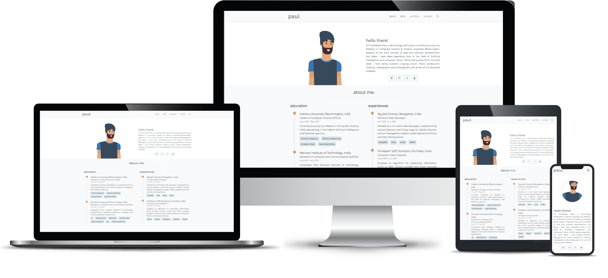
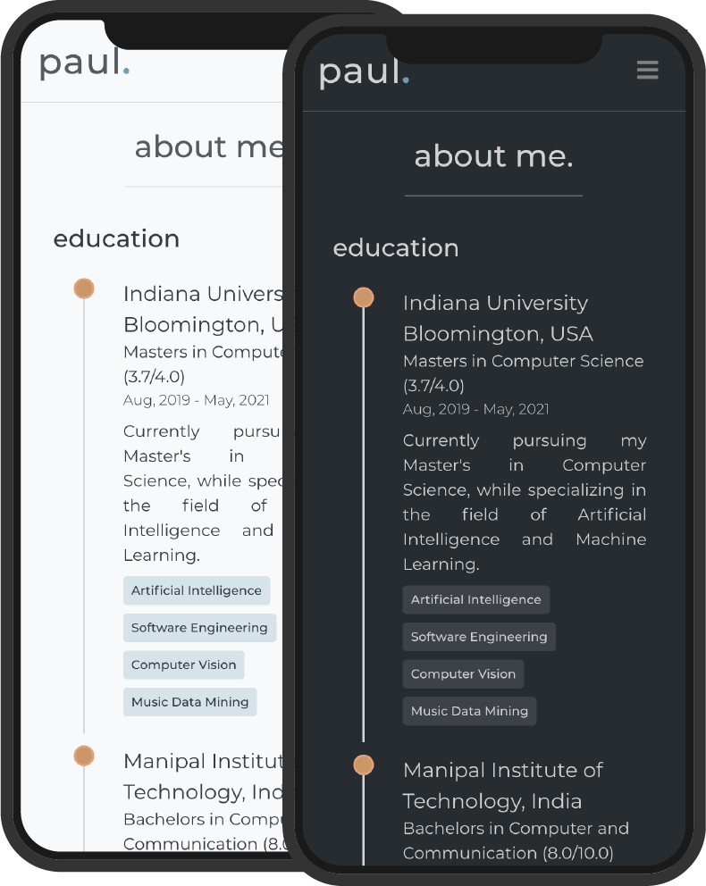
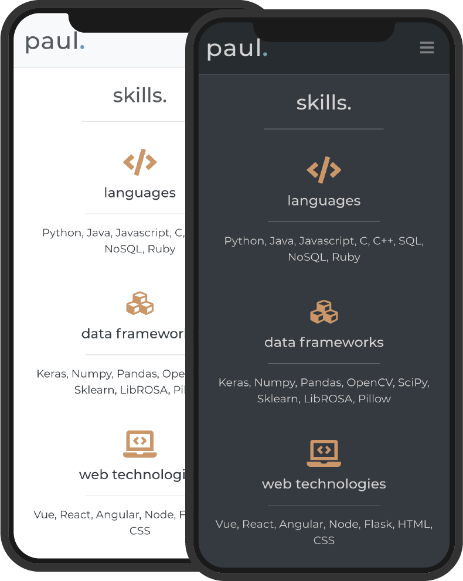
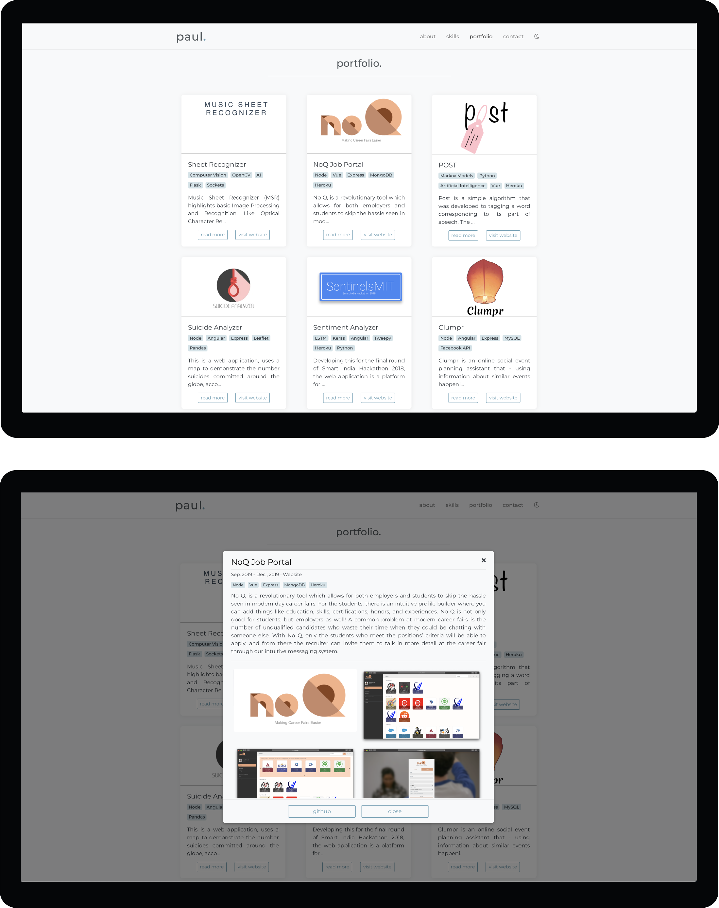
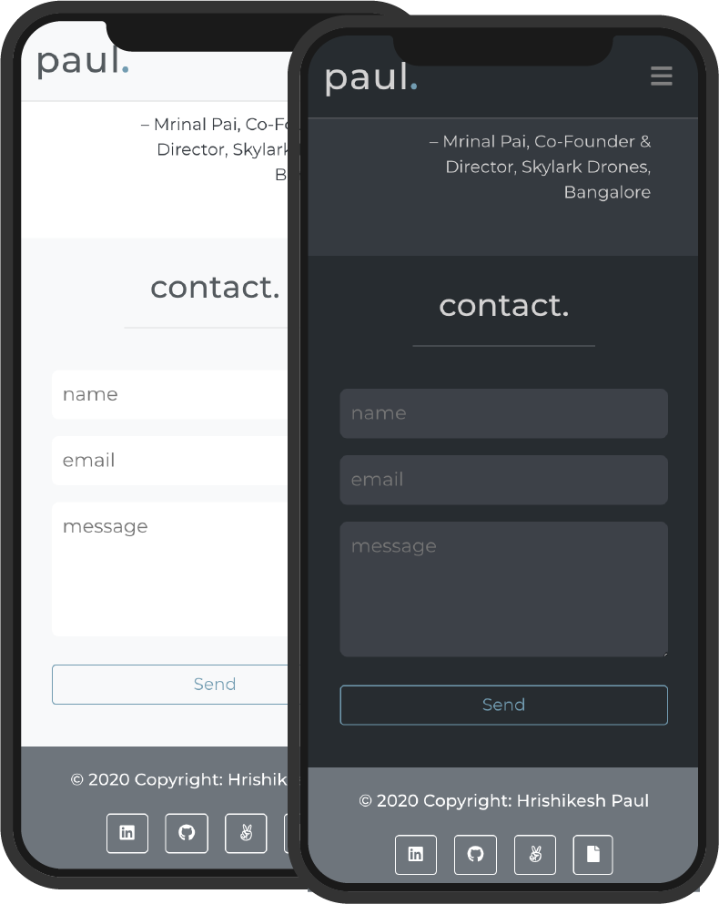

# Portfolio Template 🖐

> This is a simple, minimal and responsive personal website template, built using vue-js, html and css.

[](https://hrpaul.web.app/)
[](https://github.com/npm/cli)
[](https://github.com/hrishikeshpaul/portfolio-template/blob/master/LICENSE) 
[](https://github.com/vuejs/vue)

### 🚀 New portoflio temaple [here](https://github.com/hrishikeshpaul/portfolio-template-v2)


--- 



<!-- 
 -->

💻 Live [demo](https://hrpaul.web.app/)

---

## Table of Contents

- [Installation](#installation)
- [Features](#features)
- [Usage](#usage)
- [Contributing](#contributing)
- [Connect](#connect)
- [License](#license)

---

## Installation 

### Dependencies
These are the local dependencies that are needed for development,

- npm
- git

### Clone

Get this repo to your local machine using,
```shell
$ git clone https://github.com/hrishikeshpaul/portfolio-template.git
```

### Setup 

To install the node packages used in the project:

```shell
$ cd portfolio-template
$ npm install
```

Compiles and hot-reloads for development

```shell
$ npm run serve
```

Compiles and minifies for production
```shell
$ npm run build
```

---

## Features 

A few notable elements that makes the website intuitive to use,
| # | Feature | Screenshot |
| - | - | - |
| 1 |**Timeline**: Educations and Experiences are the in a timeline format. It shows most of the important details, a small description, and certain important keywords. The code to the timeline component can be found in [`/src/components/helpers/Timeline.vue`]("https://github.com/hrishikeshpaul/portfolio-template/blob/master/src/components/helpers/Timeline.vue"), that is placed in the `About.vue` component.|  |
| 2 |**Skills**: These display your skills by grouping them together. Along with a logo to depict each group, gives a great perception experience. The code to the skills component can be found in [`/src/components/Skills.vue`]("https://github.com/hrishikeshpaul/portfolio-template/blob/master/src/components/Skills.vue").|  |
| 3 |**Portfolio**: This is the place where you can show off your work samples. It uses responsive cards to display a snippet of your work along with some important tags and a small description. Additional, it also gives you the option to read more, or visit your work sample. Upon clicking read more, a modal dialog is opened, that enlists all the details of your work sample. It also has a gallery that shows various snippets of your work. The code to the portfolio component can be found in [`/src/components/Portfolio.vue`]("https://github.com/hrishikeshpaul/portfolio-template/blob/master/src/components/Skills.vue"), with the respective components, `/helper/Card.vue`, `/helper/Modal.vue` and `/helper/Gallery.vue`|  |
| 4 | **Contact:** A contact form has been added to recieve feedback or any sort of message. This form uses an API called [emailjs](https://www.emailjs.com/). A detailed guide to set up your own emailing service is mentioned below (don't worry, it's free). All the code for the contact form can be found in `src/components/Contact.vue`|  |
 
--- 

## Usage 

This section goes over the tweaks that need to be made, and where can they be made. It also talks about the free emailing service that is been used.

### Information 

All the information on the template is present in `info.js` that can be found in the root director, or [here](https://github.com/hrishikeshpaul/portfolio-template/blob/master/info.js). This consists of various parameters that handle the information on the website. To add your own information, just edit the contents of this file, and the changes should be noticed. All the pictures need ot be present in `/src/assets` (or you can configure the path in the info.js file).

### Email.js 

The **contact** section of the template makes use of this API called [emailjs](https://www.emailjs.com/). It is a good service that provides 200 email free every month. You will need to configure your own emailjs account for the service to work.

#### Configuration
1. Head over to [emailjs](https://www.emailjs.com/) and create your account.
2. Once logged in, select a service. In my case I selected **gmail**.
3. Head over to **Email Templates** on the side and click on **Email Template Example**. Here, there are few changes to be made if you don't want to change the template's javascript code.
    - Change the subject attribute to: `New message from {{from_name}}!`
    - Change the body to, 
    ```js
    Hello {{to_name}},

    You got a new message from {{from_name}}:

    {{{message_html}}}

    My contact is: {{user_email}}.
    ```
    You can configure this however you want, but the attributes in the `{{ }}` need to be those.
4. Create a file called `config.js` in the root of the project. You'll notice that the `.gitignore` has the name of this file. This is where all the data that links your web app to emailjs will be stores.
5. Create a object that looks like this,
   ```js
   let config = {
        emailjs: {
            serviceID: '<serviceID>',
            templateID: '<templateID>',
            userID: '<userID>'
        }
    }

    export default config;
   ```
6. You need to get the above mentioned IDs from your emailjs account,
   - **serviceID**: From `Email Services`
   - **templateID**: From `Email Templates`
   - **userID**: From `Account` > `API Keys`

> Make sure your `config.js` is in `.gitignore` as you do not want to expose your keys to the public.

---

## Contributing 

### Option 1
  - Clone this repo to your local machine using `https://github.com/hrishikeshpaul/portfolio-template.git`
- Code code code!
- Create a new pull request using <a href="https://github.com/hrishikeshpaul/portfolio-template/compare/" target="_blank">`https://github.com/hrishikeshpaul/portfolio-template/compare/`</a>


### Option 2
- Create an issue request, and I'll be certain to look at it as soon as possible!
---

## Connect

Reach out to me at one of the following places!

- Website at <a href="https://hrishikeshpaul.github.io/" target="_blank">`https://hrishikeshpaul.github.io/`</a>
- LinkedIn at <a href="https://www.linkedin.com/in/hrishikeshpaul/" target="_blank">`hrishikeshpaul`</a>

---

## License

[](https://github.com/hrishikeshpaul/portfolio-template/blob/master/LICENSE) 

- **[MIT license](http://opensource.org/licenses/mit-license.php)**
- Copyright 2020 © <a href="https://hrishikeshpaul.github.io/" target="_blank">Hrishikesh Paul</a>
